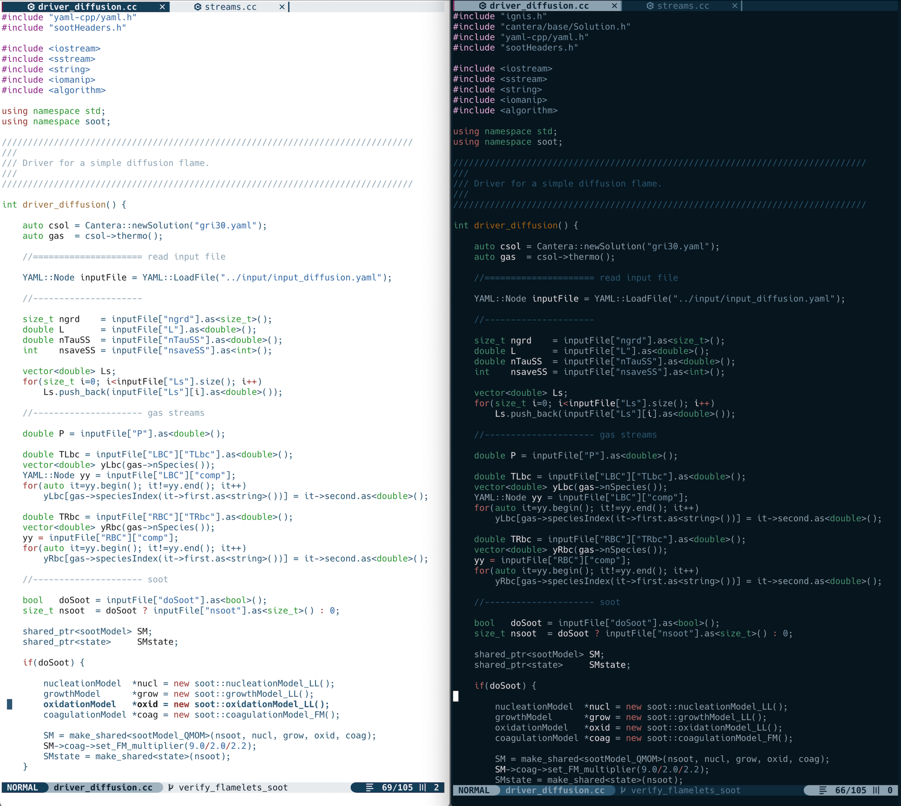

# Neovim configuration in lua.

## Installation
Clone this repository into `~/.config/`
* Backup any existing `nvim` folder before doing this.

## Themes
Two new themes are written in Lush: repent (light) and forsake (dark)

